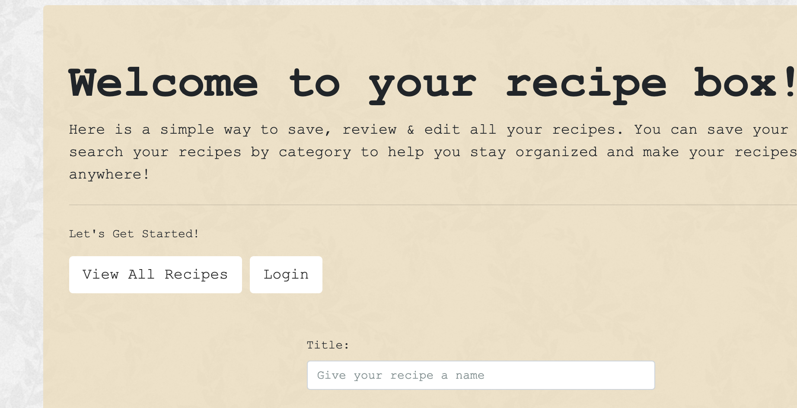
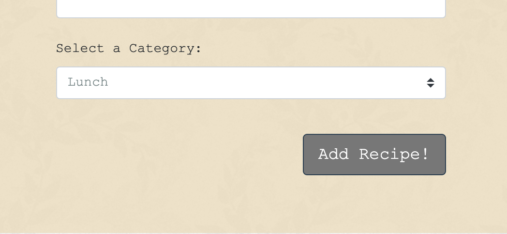

# Recipe Box

Project #2 full stack application

## [Recipe Box](https://)

An application that allows you to move your recipe cards to a digital database. Create an account and start saving your recipes today!

## Purpose / User Story

As a user with a lot of recipes, I want a place where I can save, organize & access them at any time.

# Functionality

On load you will arrive at your recipe home page. Fromt here you can go to view all your recipes. Once you view all your recipes you can click on the category to view recipes filtered by category.

From the home page you can fill out the form to add a new recipe and save it to your current set of recipes.

### Content Flow

### Backend Functionality

## User Interface

On load you will be brough to the home page.

When you add a recie choose a category so you can sort it later.

## Technologies used

-express
-express handlebars
-bootstrap
-sequelize
-MySQL

This site is deployed via Heroku

## Project GitHub Participants

Spencer Fife
Lisa Cabrera
Esther Walker
Marie Lenac
